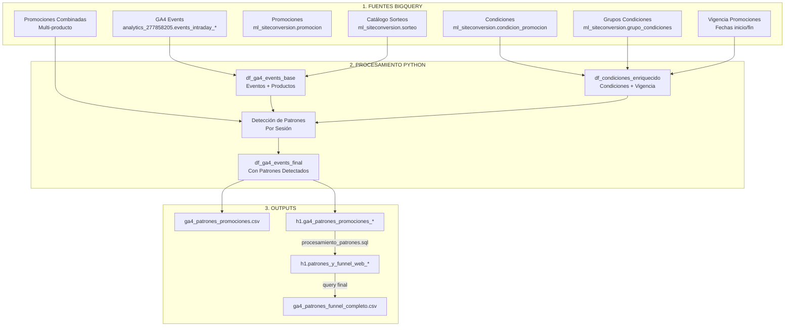
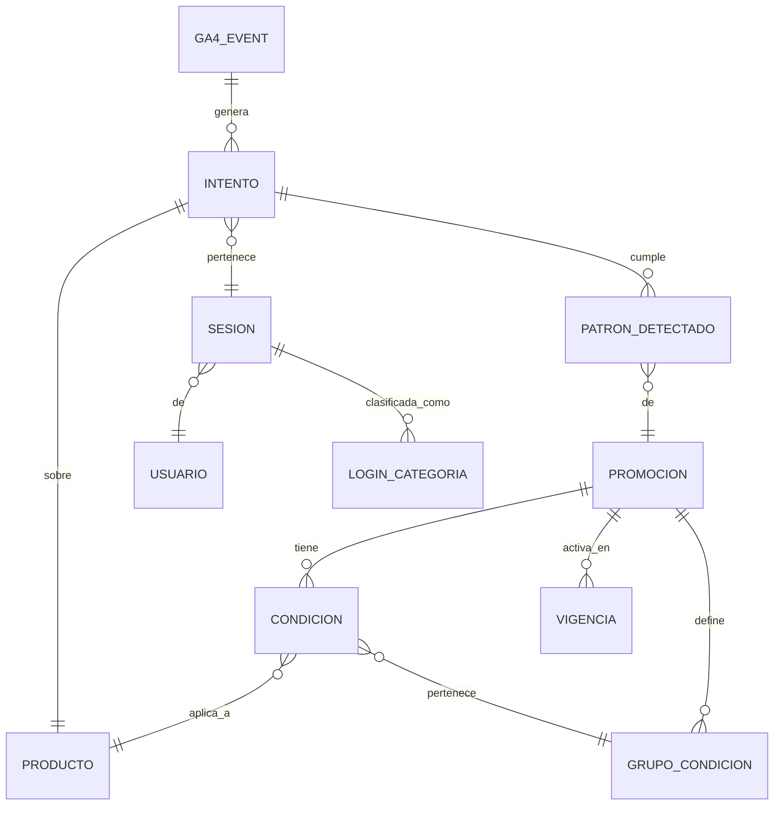

# Modelo de Datos y Flujo de Transformaciones

## Diagrama de Flujo de Datos


## Flujo de Transformaciones en el Script

### Etapa 1: Preparación Base de Datos

#### 1.1 Carga de Eventos GA4
```python
df_ga4_events = execute_query_to_df(query_ga4_events)
# Columnas: USER, SESION, DATETIME, ITEM, INTENTO, STATUS, 
#           CANTIDAD_ADD_TO_CART, CANTIDAD_BEGIN_CHECKOUT, CANTIDAD_PURCHASE
```

#### 1.2 Enriquecimiento con Catálogo de Sorteos
```python
df_ga4_events_base = df_ga4_events.merge(
    df_sorteo[['item_completo', 'clave_edicion_producto', 'precio_unitario']],
    left_on='ITEM',
    right_on='item_completo'
)
# Agrega: clave_edicion_producto, precio_unitario
# Calcula: MONTO_ADD_TO_CART, MONTO_BEGIN_CHECKOUT, MONTO_PURCHASE
```

### Etapa 2: Preparación de Condiciones de Promociones

#### 2.1 Unión de Condiciones con Grupos
```python
df_condiciones_base = df_condiciones.merge(
    df_grupo_condicion[['clave_grupo_condiciones', 'clave_promocion']],
    on='clave_grupo_condiciones'
)
# Asocia cada condición con su promoción
```

#### 2.2 Agregar Vigencia de Promociones
```python
df_condiciones_base = df_condiciones_base.merge(
    df_fechas_promocion[['clave_promocion', 'd_inicio_promocion', 'd_cierre_promocion']],
    on='clave_promocion'
)
# Agrega fechas de vigencia para validación
```

#### 2.3 Interpretación de Tipos de Condición
```python
df_condiciones_enriquecido = df_condiciones_base.merge(
    df_tipo_cantidad[['clave_tipo_cantidad_condicion', 'descripcion']],
    on='clave_tipo_cantidad_condicion'
)
# Agrega descripción legible de cada tipo de condición
```

### Etapa 3: Identificación de Promociones Multi-Producto
```python
# Promociones combinadas (requieren múltiples productos)
df_promos_combinadas → promos_multi (set de IDs)

# Estructura de requisitos por promoción
requisitos_multi = {
    promocion_id: [
        {'clave_edicion_producto': 123, 'cantidad_requerida': 2},
        {'clave_edicion_producto': 456, 'cantidad_requerida': 3}
    ]
}

# Diccionario de vigencia
vigencia_promo = {
    promocion_id: (fecha_inicio, fecha_cierre)
}
```

### Etapa 4: Detección de Patrones (Core del Negocio)
```python
for (user, sesion), df_sesion in df_ga4_events_base.groupby(['USER', 'SESION']):
    
    # 4.1: Evaluar promociones combinadas a nivel sesión
    promociones_completas_sesion = evaluar_promociones_sesion(
        df_sesion, requisitos_multi, vigencia_promo
    )
    # Returns: {'add_cart': [promos], 'checkout': [promos], 'purchase': [promos]}
    
    # 4.2: Detectar patrones por producto
    for row in df_sesion:
        resultado = detectar_patrones_producto(
            row, 
            df_condiciones_enriquecido,
            promociones_completas_sesion,
            promos_multi
        )
        # Returns: {
        #   'PATRON_ADD_CART': 'SI/NO',
        #   'PROMOS_ADD_CART_COMPLETAS': [ids],
        #   'PROMOS_ADD_CART_INCOMPLETAS': [ids],
        #   ...
        # }
```

### Etapa 5: Consolidación y Agregación

#### 5.1 Unión de Resultados
```python
df_ga4_events_final = pd.concat([df_ga4_events_base, df_resultados], axis=1)
# Une datos originales con patrones detectados
```

#### 5.2 Agregación a Nivel Sesión
```python
df_sesiones = df_filtrado_copy.groupby(["user_pseudo_id", "session_id"]).agg({
    "categoria_login": "first",
    "MONTO_BEGIN_CHECKOUT": "sum",
    "MONTO_PURCHASE": "sum",
    "PATRON_BEGIN_CHECKOUT": lambda s: (s == "SI").any()
})
```

### Etapa 6: Generación de Outputs
```python
# Output 1: Detalle por producto-intento
df_ga4_events_final.to_csv('ga4_patrones_promociones.csv')
BQLoad.load_table(df_ga4_events_final, 'h1.ga4_patrones_promociones_*')

# Output 2: Vista consolidada con funnel
execute_ddl(query_procesamiento_patrones)  # Crea tabla final en BQ
df_patrones_funnel = execute_query_to_df(query_patrones_funnel_completo)
df_patrones_funnel.to_csv('ga4_patrones_funnel_completo.csv')
```

## Entidades y sus Relaciones

### Diagrama Entidad-Relación


### Descripción de Entidades Principales

| Entidad | Descripción | Campos Clave | Origen |
|---------|-------------|--------------|--------|
| **USUARIO** | Usuario único anonimizado | user_pseudo_id | GA4 |
| **SESION** | Agrupación de eventos continuos | session_id, user_pseudo_id, session_date | GA4 + Cálculo |
| **INTENTO** | Secuencia hacia compra por producto | intento_id, producto, status | Calculado |
| **PRODUCTO** | Sorteo/boleto vendible | clave_edicion_producto, precio_unitario | Catálogo |
| **PROMOCION** | Oferta comercial | clave_promocion, tipo (simple/combinada) | Catálogo |
| **CONDICION** | Requisito de promoción | tipo_cantidad, cantidad_inicial | Catálogo |
| **PATRON_DETECTADO** | Promoción cumplida/incompleta | tipo (completa/incompleta), etapa | Calculado |

## Transformaciones Clave de Negocio

### 1. Cálculo de Intentos
Un "intento" representa una secuencia de acciones sobre un producto que termina en compra o abandono:
```
Eventos: [add_cart → checkout → purchase] = Intento 1 (PURCHASED)
Eventos: [add_cart → checkout] + [add_cart → purchase] = Intento 1 + Intento 2
```

### 2. Inferencia de Precios
Cuando no hay compra, se infiere el precio desde el catálogo:
```
Si qty_purchase > 0:
    precio = MONTO_PURCHASE / qty_purchase
Sino:
    precio = buscar_en_catalogo(producto)
```

### 3. Categorización de Login
Clasifica el momento exacto del login en el funnel:
```
Tiempo →
[session_start]...[view_item]...[LOGIN]...[add_cart]...[checkout]...[purchase]
                                    ↑
                        Categoría: "LOGIN ANTES DE ADD_TO_CART"
```

### 4. Detección de Near-Miss
Identifica usuarios a un paso de completar promoción:
```
Promoción: "Compra 5 boletos"
Usuario compró: 4 boletos
Estado: INCOMPLETA (near-miss)
Acción sugerida: Remarketing con descuento adicional
```

## Outputs Finales

### Tabla: `patrones_y_funnel_web_*`

| Grupo de Campos | Descripción | Uso de Negocio |
|-----------------|-------------|----------------|
| **Identificadores** | user_pseudo_id, session_id, ITEM, intento | Trazabilidad completa |
| **Cantidades** | qty_add_to_cart, qty_begin_checkout, qty_purchase | Análisis de conversión |
| **Montos** | MONTO_* por etapa, precio_unitario_inferido | Revenue analysis |
| **Patrones** | PATRON_*, PROMOS_*_COMPLETAS/INCOMPLETAS | Efectividad promociones |
| **Contexto Sesión** | categoria_login, login_time_mx, discount_seen | Comportamiento usuario |
| **Flags** | has_purchase, ready_at_checkout, tiene_patron_completo | Segmentación |

### Particionamiento y Performance
```sql
PARTITION BY attempt_date        -- Reduce costos 90%
CLUSTER BY ITEM, STATUS, login_bucket_bc  -- Acelera queries frecuentes
```

## Validaciones de Integridad

### Checks Implementados

1. **Consistencia de cantidades**: cart ≥ checkout ≥ purchase
2. **Vigencia de promociones**: fecha_evento entre inicio y cierre
3. **Precios positivos**: precio_unitario > 0
4. **Deduplicación**: Un evento por user-session-product-timestamp
5. **Completitud de sesión**: Toda sesión tiene al menos un evento

### Manejo de Casos Edge

| Caso | Manejo | Impacto |
|------|--------|---------|
| Precio faltante | Inferir desde catálogo | Montos calculados |
| Promoción sin vigencia | Ignorar | No se detecta patrón |
| Login sin timestamp | Categorizar como "SIN LOGIN" | Análisis de conversión |
| Producto no catalogado | Mantener con NULL | Sin análisis de promoción |

## Métricas de Calidad
```python
# Validación post-procesamiento
assert df_final['qty_purchase'].sum() == ventas_totales_periodo
assert df_final['MONTO_PURCHASE'].sum() == revenue_total_periodo
assert df_final[df_final['STATUS'] == 'PURCHASED']['transaction_id'].notna().all()
```